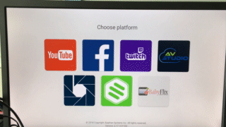

# Introduction

Welcome to the AV Studio API! You can use our API to pair, control and monitor Epiphan devices.

We have language bindings in Shell and Python. You can view code examples in the dark area to the right, and you can switch the programming language of the examples with the tabs in the top right.

# Big picture

Each device (and Pearl if AV Studio is not disabled) keeps long poll connection to AV Studio and waits for commands. Initially, all devices are *unpaired*, which means that they are not assiciated with any AV Studio account. To pair a device, one should login into their account and send pairing command to AV Studio with pairing code. AV Studio finds device that has this code and connects it to the AV Studio account.

# Authentication

```python
from avstudio.avstudio import AVStudioAPI

api = AVStudioAPI("go.avstudio.com")
api.login(USERNAME, PASSWORD)
```

```shell
curl -v https://go.avstudio.com/front/api/v1t/oauth/base/USERNAME?pwd=PASSWORD
```

To login into your AV Studio account, use this code:

```
> GET /front/api/v1t/oauth/base/USERNAME?pwd=PASSWORD HTTP/2
> Host: go.avstudio.com
> User-Agent: curl/7.54.0
> Accept: */*
>
< HTTP/2 302
< server: nginx/1.11.3
< date: Fri, 12 Oct 2018 17:43:42 GMT
< content-type: text/html; charset=utf-8
< content-length: 91
< location: https://go.avstudio.com/TEAMID#/scenes
< set-cookie: KSESSIONID=KSESSIONID; Path=/; Expires=Sat, 12 Oct 2019 17:43:42 GMT; Max-Age=31536000
< x-current-team-id: TEAMID
< strict-transport-security: max-age=15724800; preload
```

The successful response will have team and session identifiers, which will be used in further requests (Python avstudio module does it automatically).

# Getting All Devices

There's two devices in a newly created AV Studio account, let's retrieve them:

```python
devices = api.Devices.get_all()
for d in devices:
    print d["Id"], d["Name"]

# Output:
# demo_0_d3d68f3c-cd3e-4ee6-ab25-4646973c6277 My First Demo Device
# demo_1_4e0a964a-b350-435f-82c9-de6ab5188af2 My Second Demo Device
```

```shell
curl https://go.avstudio.com/front/api/v1t/team/TEAMID/devices \
  -H "Cookie: KSESSIONID=KSESSIONID"
```

> The above command returns JSON with device infos:

```json
[
  {
    "Id": "demo_0_d3d68f3c-cd3e-4ee6-ab25-4646973c6277",
    "Name": "My First Demo Device",
    "Model": "Demo",
    "Status": "Online",
    "Recording": "unknown",
    "StateTime": 1539366714.931,
    "SnapshotURL": "/front/api/v1/devices/demo_0_d3d68f3c-cd3e-4ee6-ab25-4646973c6277/state.jpg",
    "IsUnpaired": false,
    "Telemetry": {}
  }
]
```

`GET /front/api/v1t/team/TEAMID/devices`

Parameter | Description
--------- | -----------
TEAMID | Team ID from auth response

# Getting a Specific Device

```python
device = api.Devices.get("demo_0_d3d68f3c-cd3e-4ee6-ab25-4646973c6277")
```

```shell
curl https://go.avstudio.com/front/api/v1t/team/6ef82053-5bb5-4ba6-9e43-e8565a827b9c/devices/demo_0_d3d68f3c-cd3e-4ee6-ab25-4646973c6277 \
  -H "Cookie: KSESSIONID=SESSIONID"
```

> Result:

```json
[
  {
    "Id": "demo_0_d3d68f3c-cd3e-4ee6-ab25-4646973c6277",
    "Name": "My First Demo Device",
    "Model": "Demo",
    "Status": "Online",
    "Recording": "unknown",
    "StateTime": 1539366714.931,
    "SnapshotURL": "/front/api/v1/devices/demo_0_d3d68f3c-cd3e-4ee6-ab25-4646973c6277/state.jpg",
    "IsUnpaired": false,
    "Telemetry": {}
  }
]
```

`GET /front/api/v1t/team/TEAMID/devices/DEVICEID`

Parameter | Description
--------- | -----------
TEAMID | Team ID from the auth response
DEVICEID | The ID of the device to retrieve

# Pairing a Real Device

Let's pair a real device.

### Switching the Device to AV Studio mode

Switch the device to AV Studio mode by either double pressing the power button on the device until that little screen shows Epiphan logo:


...or by selecting AV Studio on a monitor, connected to Webcaster's HDMI output:



### Pairing the Device

To pair a device we use the following endpoint:

`POST /front/api/v1t/team/TEAMID/devices`


```python
r = api.Devices.add("5cf06c29", "NEW DEVICE")
device_id = r["ID"]
```

```shell
curl -X POST https://go.avstudio.com/front/api/v1t/team/TEAMID/devices \
  -H "Cookie: KSESSIONID=SESSIONID" \
  -d '{"DeviceID": "5cf06c29", "Name": "NEW DEVICE"}'
```

> Result:

```json
{
    "Status": "ok",
    "StatusCode": 200,
    "ID": "DEVICEID"
}
```

# Device Commands

## Sending Commands to Devices

> e.g. setting bitrate to 1 Mbit/s:

```python
api.Devices.run_command(deviceId, "setparam:bitrate=1000")
```

```shell
curl https://go.avstudio.com/front/api/v1t/team/TEAMID/devices/DEVICEID/task \
 -H "Cookie: KSESSIONID=SESSIONID" \
 --data-binary '{"cmd": "setparam:bitrate=2000"}'
```

Commands are sent to devices by posting `{"cmd": COMMAND}` json to this endpoint:

`POST front/api/v1t/team/TEAMID/devices/DEVICEID/task`

## setparam:

```python
api.Devices.get(deviceId)["Telemetry"]["settings"].keys()

# Output: ['resolution', 'bitrate']
```

```shell
curl https://go.avstudio.com/front/api/v1t/team/TEAMID/devices/DEVICEID \
-H "Cookie: KSESSIONID=SESSIONID" \
| jq '.Telemetry.settings | keys'

# Output:
# [
#   "bitrate",
#   "resolution"
# ]
```

Set value of device settings parameter. Available parameters are listed in device info Telemetry/settings dictionary.

Epiphan Webcasters support the following parameters:

Param|Possible values|Description
-----|---------------|-----------
resolution|1920x1080, 1280x720, 640x360, 320x180|Stream frame size
bitrate|up to 4000|Stream bitrate, in Kbit/s

## rtmp.start:url

```python
api.Devices.run_command(deviceId, "rtmp.start:rtmp://10.1.2.16/live/test")
```

```shell
 curl https://go.avstudio.com/front/api/v1t/team/TEAMID/devices/DEVICEID/task \
 -H "Cookie: KSESSIONID=SESSIONID" \
 --data-binary '{"cmd": "rtmp.start:rtmp://10.1.2.16/live/test"}'
```

> The status of RTMP stream is reported in `Telemetry/state/rtmp`.
> 
> `speed` is actual_uploading_speed/bitrate ratio, values greater or equal to 1.0 are ok, less than 1.0 means there's no enough bandwidth.

```json
"rtmp": {
    "url": "rtmp://10.1.2.16/live/test", 
    "speed": 1.00,
    "bitrate": 2061,
    "sent": {
        "frames": 896, 
        "bytes": 7723008
    }
}
```

Starts RTMP stream to a given RTMP url.

## rtmp.stop

```python
api.Devices.run_command(deviceId, "rtmp.stop")
```

```shell
 curl https://go.avstudio.com/front/api/v1t/team/TEAMID/devices/DEVICEID/task \
 -H "Cookie: KSESSIONID=SESSIONID" \
 --data-binary '{"cmd": "rtmp.stop"}'
```

Stops RTMP stream, started by `rtmp.start`

## firmware.update

```python
api.Devices.run_command(deviceId, "firmware.update")
```

```shell
 curl https://go.avstudio.com/front/api/v1t/team/TEAMID/devices/DEVICEID/task \
 -H "Cookie: KSESSIONID=SESSIONID" \
 --data-binary '{"cmd": "firmware.update"}'
```

Starts firmware update if more recent firmware is available.

## unpair

```python
api.Devices.run_command(deviceId, "unpair")
```

```shell
 curl https://go.avstudio.com/front/api/v1t/team/TEAMID/devices/DEVICEID/task \
 -H "Cookie: KSESSIONID=SESSIONID" \
 --data-binary '{"cmd": "unpair"}'
```

Unpairs device from the account it's pared to.
